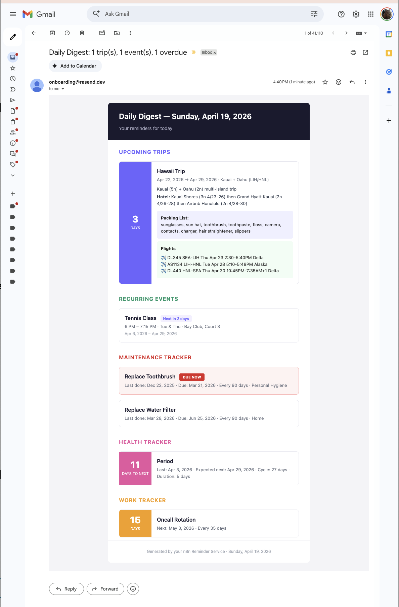

# Reminder Service

A personal automated email digest service that sends daily morning reminders covering trip countdowns, recurring event schedules, and maintenance tracking.



## Features

- **Trip Countdowns** — Progressive detail reveal as departure approaches (30-day, 7-day, 1-day tiers with JSONB data)
- **Recurring Events** — Weekly schedule tracking with "today" and "tomorrow" alerts
- **Maintenance Tracker** — Interval-based task tracking with overdue detection and color-coded urgency badges

## Architecture

```
┌─────────────┐     ┌──────────────┐     ┌────────┐
│  n8n (Docker)│────▶│  Supabase    │     │ Resend │
│  Cron 7AM   │◀────│  (Postgres)  │     │ (SMTP) │
│  Workflow    │────────────────────────▶│  API   │
└─────────────┘                          └────────┘
```

**n8n** orchestrates a daily workflow:
1. Query trips, recurring events, and maintenance items from Supabase
2. Calculate countdowns, match today's schedule, detect overdue items
3. Build an HTML email with inline CSS
4. Send via Resend API
5. Log the digest for audit

## Tech Stack

| Component | Purpose |
|-----------|---------|
| [n8n](https://n8n.io) | Workflow automation (local Docker) |
| [Supabase](https://supabase.com) | Postgres database (free tier) |
| [Resend](https://resend.com) | Email delivery (free tier) |

## Setup

### 1. Database

Create a Supabase project and run the schema in the SQL Editor:

```bash
# Run in order:
schema.sql   # Tables, enums, indexes, views
seed.sql     # Sample data (optional)
```

### 2. n8n

```bash
docker compose up -d
```

Open `http://localhost:5678` and:
1. Add a **Postgres** credential with your Supabase pooler connection string
2. Add a **Header Auth** credential with your Resend API key (`Authorization: Bearer re_...`)
3. Import `workflow.json`
4. Update the "to" email address in the Resend HTTP node
5. Toggle the workflow active

### 3. n8n Node Settings

Each of the 3 Postgres query nodes needs **"Always Output Data"** enabled in Settings (prevents chain breakage on empty results).

## Database Schema

- `trips` — One-time events with `tier_30`, `tier_7`, `tier_1` JSONB columns for progressive detail reveal
- `recurring_events` — Weekly events with `day_of_week[]` array and date range
- `maintenance_items` — Interval tracking via `last_performed` + `frequency_days`
- `digest_log` — Audit trail of sent emails

## Email Design

The digest uses inline CSS with table-based layout for email client compatibility:
- Purple countdown badges for trips
- Green/blue "Today"/"Tomorrow" badges for recurring events
- Red "DUE NOW" / yellow "DUE SOON" badges for maintenance items

## Deployment

Currently runs locally via Docker. For always-on hosting:
- **Railway / Fly.io** — Deploy the Docker container (~$5-10/mo)
- **n8n Cloud** — Managed hosting (~$24/mo)

## License

MIT
